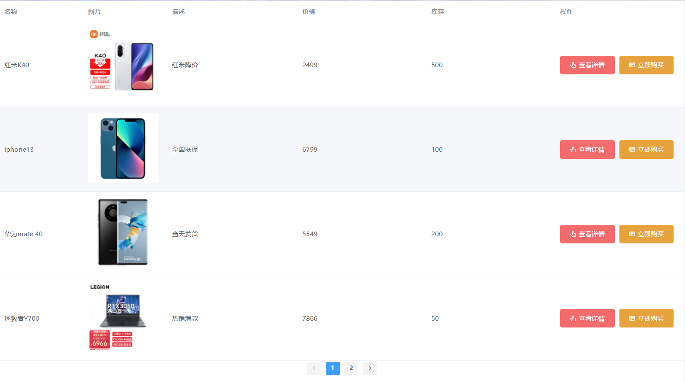
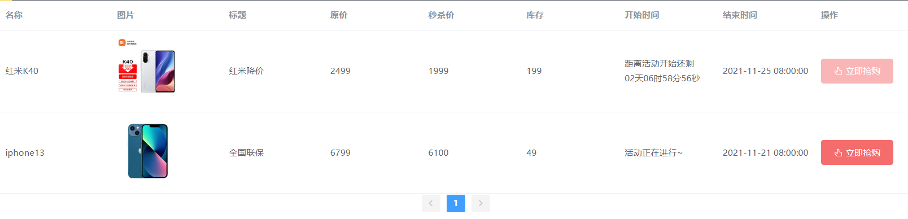

# 秒杀系统前端开发

该项目主要配合后台的秒杀项目搭建的前端项目，主要为了练习Vue，所以只做功能不做样式。

## 一、项目搭建

### 1.1 创建cli

1. 创建文件夹spike_sys_front

2. 进文件夹，使用cmd输入

   ````shell
   vue create spike_sys_front
   ````

3. 使用vs-code打开该文件夹。

### 1.2 引入基本组件

> 引入路由插件：

1. 在终端中安装vue-router

   ````shell
   npm install vue-router
   ````

2. 创建路由文件

   在src文件夹下创建router文件夹，在里面创建index.js

3. 在main.js中引入相关插件和配置

   `````js
   // 引入vue的路由插件
   import VueRouter from 'vue-router'
   // 引入路由器
   import router from './router'
   // 应用路由插件
   Vue.use(VueRouter)
   `````

> 引入axios插件

1. 在终端中安装axios

   ````shell
   npm install axios
   ````

2. 在需要使用的组件中导入

> 引入Element组件

1. 安装Element-ui

   `````shell
    cnpm install element-ui --save
   `````

2. 导入插件（这里使用全局导入）

   ````js
   // 引入elementui插件
   import ElementUI from 'element-ui';
   // 引入完整样式
   import 'element-ui/lib/theme-chalk/index.css';
   // 应用element插件
   Vue.use(ElementUI)
   ````

### 1.3 创建目录结构(src)

```shell
src
 |___components
 |       |_______Home(整个页面)
 |       |_______Head(头部导航栏)
 |       |_______Aside(侧边栏)
 |       |_______Main(中间主体)
 |      
 |___router
 |      |______index.js
 |
 |___pages(路由组件)
 |     |_______Login(登录组件)
 |     |_______路由组件2
 |
 |___assets（静态资源）
 |
 |___App.vue
 |
 |___main.js
```

## 二、功能实现

### 2.1 登录界面

> 登陆界面设计思想：点击右上角登录按钮，触发路由——在Main界面激活Login组件，显示登录界面；输入信息后将表单数据使用axios提交到后台。
>
> 设计点：
>
> 1. 用户点击右上角登录，将会显示登录界面（由路由实现显示）
> 2. 输入用户名、密码之后可以点击提交：会先判断是否为空再提交
> 3. 发送ajax请求至后台并获取返回结果：判断状态码是否请求成功、成功之后修改使右上角显示用户名称、跳转到主显示界面；登录失败提示用户登录失败。`注意`：使用axios发送ajax请求需要添加axios.defaults.withCredentials=true;以携带cookie。
> 4. 点击关闭：回到上一步。

### 2.2 一般商品展示

商品展示设计思想：当用户登陆成功之后跳转到Show组件，在created函数中发送请求获取分页的商品信息。

设计点：

1. 在created函数中发送请求；
2. 根据响应的状态码判断是否请求成功，并将返回的数据当定到组件中；
3. 使用el-table将商品展示在table中（需要注意在表格中插入图片的操作）
4. 使用el-pagination设置分页栏（注意属性的设置，尤其是当前页改变所绑定的函数调用）

效果如下：



### 2.3 秒杀商品展示

总体思路与2.2一致，主要区别在于：

- 这里显示的信息更多。

- 访问该页面需要先登录。

- 活动倒计时显示：

  1. 这里对于活动开始倒计时放在单独的组件中，并使用到*[moment.js](http://momentjs.cn/docs/#/use-it/)* 日期处理类库（详见CountDown.vue文件）

  2. 安装*[moment.js](http://momentjs.cn/docs/#/use-it/)* 

     `````shell
     npm install moment
     `````

  3. 创建CountDown组件，导入moment类库

  4. 主要逻辑：判断当前时间是否早于开始时间——是则显示倒计时；判断当前时间是否晚于结束时间——是则显示活动结束。（详细内容见CountDown.vue文件）

  5. 在父组件秒杀组件中引入该组件即可实现。

- 结束时间显示：使用moment.js对后台数据格式化后显示（详见OverTime.vue文件）

- 待优化：根据活动状态设置按钮的状态（颜色、是否可以点击等）

效果如下：



### 2.4 商品购买

**一般商品购买与秒杀商品前端实现上基本一致**：

> 商品购买只需要点击立刻购买按钮即可。
>
> 功能实现；
>
> - 点击按钮后会触发点击事件调用提交方法
> - 方法中需要传入商品的id以备后台查询商品信息
> - 方法中发送ajax请求执行购买操作
> - 根据后台返回的状态码判断跳转的路由：20000（正常）：刷新组件；22222（未登录）：跳转到登陆界面；其他：显示后台返回的错误信息，如以抢过不能再次抢购等。

